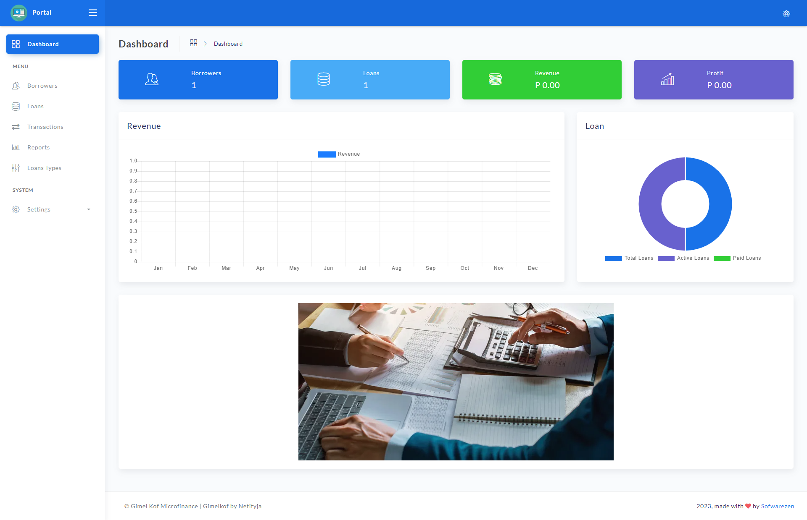
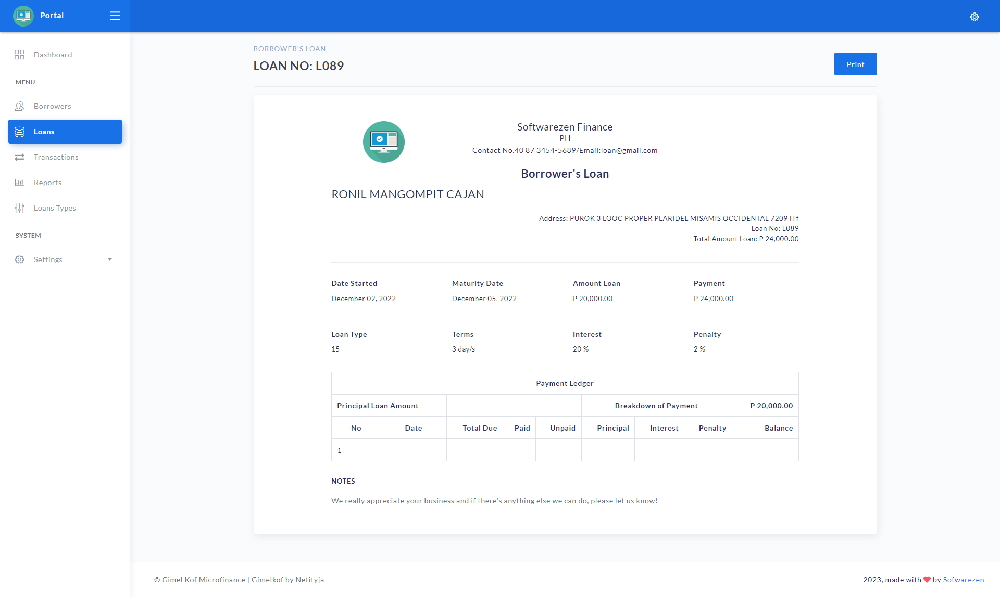
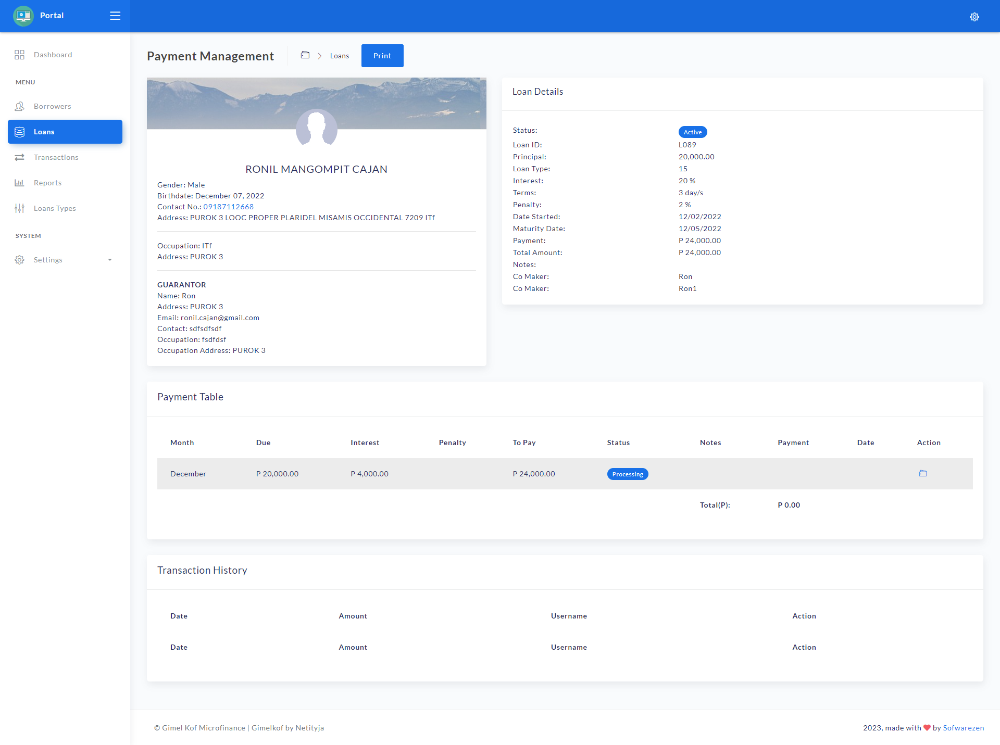

###################
 Loan Application
###################

This is a web-based application built using CodeIgniter 3, a popular PHP framework, 
designed to streamline the loan application process. This application allows users to 
apply for a loan by filling out a form, and administrators can manage and approve/reject loan applications.

*******************
Features
*******************

* Secure user authentication and access control
* User management, including adding, editing, and deleting users and assigning roles and permissions
* Borrower management, including adding, editing, and deleting borrowers
* Loan management, including adding, editing, and deleting loans 
* Reports 
* Built using the CodeIgniter 3 PHP framework for modularity and ease of maintenance

*******************
Requirements
*******************

- PHP 5.6+
- MySQL 5.6+
- Apache or Nginx web server
- CodeIgniter 3 framework

*******************
Installation
*******************

1. Clone the repository or download the ZIP file and extract it to your web server's document root.
2. Import the SQL dump file `loan_application.sql` into your MySQL database.
3. Modify the database configuration settings in `application/config/database.php`.
4. Modify the base URL in `application/config/config.php`.
5. Navigate to the base URL in your web browser to access the loan application.

*******************
Usage
*******************

- Users can register for an account and log in to apply for loans and view the status of their loan applications.
- Admins can log in to the admin panel to view, approve, or reject loan applications.

*******************
Screenshots
*******************

*******************
License
*******************

This project is licensed under the MIT License. See the `LICENSE` file for details.
